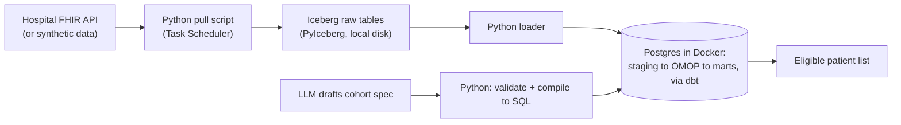

# Cohort Generation Platform: Approach & Recommendation

---

## Overview

**The plan in one breath:** We pull patient records from a hospital's system in a standard format (FHIR), keep a permanent untouched copy the moment we receive it, translate every hospital's medical terms into one shared vocabulary, load everything into a standard research database (OMOP), and then turn a clinical trial's written eligibility rules into a precise, explainable patient list — with an AI drafting the rules from the protocol, but never touching the database directly.

Everything runs on free, local tools for now. Nothing about that choice is throwaway — each tool has a direct upgrade path to paid cloud services later, one piece at a time, only when actually needed.

---

## The problem, briefly

Every hospital describes the same patient differently, transformations will need fixing after the fact, and a clinical trial's patient list has to be explainable months later. The whole pipeline exists to solve exactly those three problems — nothing more.

**Worked example carried through this whole document:** a 55-year-old with Type 2 diabetes, an HbA1c of 8.2%, taking Metformin.

---

## Architecture diagram

What we'd actually run on day one — free and local, with a direct upgrade path to managed cloud services already built in.



- **Iceberg (via PyIceberg, no Spark needed)** keeps a permanent, versioned copy of every record exactly as received.
- **Postgres** holds the standardized OMOP warehouse — the same database OHDSI's own research tools expect.
- **dbt** does every transformation and blocks bad data with automated tests before it reaches OMOP.
- **The AI only ever drafts a structured spec**; a separate, deterministic step compiles and runs the actual SQL.

---

## Concerns identified

A critical pass over the starting design, before any tool was chosen — ranked by how much damage each would actually do.

| Concern | Severity | How it's addressed |
|---|---|---|
| Raw copy isn't actually protected or traceable | **Critical** | Immutable, versioned Iceberg snapshots + a metadata table linking every OMOP row back to its source. |
| A patient can silently vanish from a cohort | **Critical** | Every unmapped medical code is reported, not silently dropped. |
| Same cohort, different answer next time | **Critical** | Every result stamped with the exact code version, vocabulary version, and data snapshot used. |
| Whole pipeline depends on one machine | High | Each job logs its own success/failure to Postgres; alerts on failure. |
| Data arrives stale, on a timer | High | Incremental FHIR sync (only pull what changed), pending confirmation the source supports it. |
| Nothing checks data quality before OMOP | High | Automated dbt tests gate every load. |
| No enforced limit on what the AI can see | High | AI only ever receives protocol text + vocabulary lookups — never raw patient rows or database access. |
| One hospital's bad data can break everyone's pipeline | Medium | Each source gets its own isolated scheduled job. |
| No one would notice a data or cohort-size anomaly | Medium | Daily row-count / cohort-size comparison check. |
| Security assumed, not designed | Medium | Credentials in a local `.env` file now, Key Vault + managed identities once this moves to Azure. |

---

## Proposed approach

The smallest set of proven, free tools that closes every concern above — nothing here requires a paid Azure subscription.

| Piece | Pick, free & local | Upgrades to, later |
|---|---|---|
| Raw storage | Iceberg tables on local disk (PyIceberg) | Same tables, pointed at Azure Data Lake |
| Warehouse | Postgres in Docker | Azure Database for PostgreSQL |
| Transformation & tests | dbt Core | Unchanged |
| Scheduling | Windows Task Scheduler / cron | Azure Data Factory |
| Secrets | Local `.env` file | Azure Key Vault |
| Monitoring | A Postgres run-log + daily check script | Azure Monitor |
| Vocabulary | OHDSI Athena download, versioned | Unchanged |
| Cohort AI | LLM drafts spec; Python compiles + runs SQL | Unchanged — this rule holds regardless of budget |

**Deliberately not using yet:** Spark, Kubernetes, Kafka/streaming, and a full orchestrator like Airflow — none of them fix a problem this project has at its current scale. Each has a specific, named trigger (in the full workbook) for when it would start earning its cost.

---

## Backend structure: how we'll actually build this

A single, small Python codebase, organized by pipeline stage — not a collection of unrelated scripts. Each folder is independently runnable and testable on its own.

```
cohort-platform/
├── .env.example                  # Template for local secrets — never committed
├── docker-compose.yml             # Spins up local Postgres
├── requirements.txt
│
├── ingestion/
│   ├── pull_fhir.py               # Pulls Bundles from a hospital's FHIR API using _lastUpdated
│   ├── validate_bundle.py         # Schema/sanity checks before anything is written
│   └── sources.yaml               # Per-hospital connection settings (credentials via .env)
│
├── raw/
│   └── iceberg_catalog.py         # PyIceberg setup — catalog metadata lives in Postgres, files on local disk
│
├── staging/
│   └── load_to_staging.py         # Flattens raw Iceberg/JSON into Postgres staging tables
│
├── vocabulary/
│   ├── athena_loader.py           # Loads/refreshes the OHDSI vocabulary tables, versioned
│   └── mapping_report.py          # Reports every source code with no standard-concept match
│
├── transform/                      # dbt project
│   ├── models/
│   │   ├── staging/                # 1:1 cleaned models, one per FHIR resource type
│   │   ├── omop/                   # PERSON, CONDITION_OCCURRENCE, MEASUREMENT, DRUG_EXPOSURE, ...
│   │   └── marts/                  # Diabetes Mart, etc. — built on top of omop/
│   ├── tests/                      # dbt tests: not-null, relationships, clinical plausibility
│   └── dbt_project.yml
│
├── cohort/
│   ├── cohort_spec.schema.json    # The JSON Schema every LLM-drafted spec must satisfy
│   ├── llm_draft.py                # Calls the LLM, returns a structured spec — nothing else
│   ├── validate_spec.py            # Validates the spec against the schema and known concept sets
│   ├── compile_sql.py              # Deterministic: spec -> parameterized SQL
│   └── run_cohort.py               # Executes the SQL, stamps the result with versions
│
├── monitoring/
│   ├── run_log_schema.sql          # Postgres table: one row per pipeline run
│   └── daily_check.py              # Row-count / cohort-size anomaly check + alert
│
├── orchestration/
│   └── run_pipeline.py             # The single entry point Task Scheduler calls each night
│
└── docs/                            # This proposal, the full workbook, etc.
```

### How it actually runs, night to night

1. **Task Scheduler** triggers `orchestration/run_pipeline.py` once a night (e.g. 2 AM).
2. It calls `ingestion/pull_fhir.py` once **per hospital source**, so one source's failure can't touch another's.
3. Each pull is validated, then written into an immutable **Iceberg snapshot**.
4. `staging/load_to_staging.py` flattens the new raw data into Postgres staging tables.
5. `dbt run` builds staging → OMOP → marts, using the vocabulary tables to map every source code to a standard concept.
6. `dbt test` runs the data-quality gate; a critical failure halts promotion and raises an alert instead of silently loading bad data.
7. `monitoring/daily_check.py` compares today's row counts against the recent average and logs everything — including the git commit hash and vocabulary version used — to the run-log table.
8. Success or failure, the run-log table now has a complete, queryable history of every pipeline run.

**Cohort generation runs separately, on demand** — not as part of the nightly batch: someone submits a trial protocol → `llm_draft.py` proposes a structured spec → `validate_spec.py` checks it → `compile_sql.py` turns it into SQL → `run_cohort.py` executes it against the OMOP marts and returns a patient list stamped with exactly which data snapshot, vocabulary version, and code version produced it.

### Core technology per piece

| Piece | Library / tool |
|---|---|
| FHIR pulls | `requests` (plain HTTP calls to the FHIR REST API) |
| Raw storage | `pyiceberg` |
| Database | PostgreSQL (Docker), accessed via `psycopg2` / `SQLAlchemy` |
| Transformation & tests | `dbt-core` + `dbt-postgres` |
| Config & secrets | `python-dotenv`, a `.env` file |
| Cohort spec validation | `jsonschema` |
| LLM calls | Anthropic (or OpenAI) SDK |
| Scheduling | Windows Task Scheduler (or cron) |
| Version control | git — every pipeline run stamps its own commit hash |

---

## Inside a FHIR record, and how it's handled

Everything above has been about the pipeline in the abstract. This section is the concrete version: what one of these JSON records actually contains, and exactly what happens to it, step by step.

A hospital doesn't send one record at a time — a query returns a **Bundle**, a JSON envelope holding a batch of resources. Inside that batch, here's what the four resources for our example patient actually look like.

**Patient**
```json
{
  "resourceType": "Patient",
  "id": "patient-88213",
  "identifier": [{ "system": "urn:hospital-mrn", "value": "MRN-88213" }],
  "gender": "male",
  "birthDate": "1971-03-14"
}
```
- `resourceType` — tells every downstream system which of the ~150 FHIR resource types this is, so it knows what fields to expect.
- `identifier` — the hospital's own patient number (MRN). Not the ID we'll use once this is in OMOP — that gets assigned fresh.

**Condition — the diabetes diagnosis**
```json
{
  "resourceType": "Condition",
  "id": "condition-4471",
  "subject": { "reference": "Patient/patient-88213" },
  "code": {
    "coding": [
      { "system": "http://hl7.org/fhir/sid/icd-10", "code": "E11.9",
        "display": "Type 2 diabetes mellitus without complications" },
      { "system": "http://snomed.info/sct", "code": "44054006",
        "display": "Type 2 diabetes mellitus" }
    ]
  },
  "onsetDateTime": "2022-06-01",
  "recordedDate": "2022-06-03"
}
```
- `subject.reference` — how FHIR links records together, like a foreign key: "this Condition belongs to that Patient."
- `code.coding` is a **list**, on purpose — the same diagnosis is often recorded in two vocabularies at once: ICD-10 (what billing uses) and SNOMED (what clinical systems use). Both describe the same real-world fact.
- `onsetDateTime` vs `recordedDate` — when the disease actually started, versus when someone typed it into the system. Cohort rules that say "diagnosed before enrollment" care about the first one.

**Observation — the HbA1c result**
```json
{
  "resourceType": "Observation",
  "id": "obs-9981",
  "subject": { "reference": "Patient/patient-88213" },
  "code": {
    "coding": [{ "system": "http://loinc.org", "code": "4548-4",
      "display": "Hemoglobin A1c/Hemoglobin.total in Blood" }]
  },
  "effectiveDateTime": "2026-05-12",
  "valueQuantity": { "value": 8.2, "unit": "%", "system": "http://unitsofmeasure.org", "code": "%" }
}
```
- Lab results use **LOINC** codes, not ICD-10 or SNOMED — a third vocabulary, specifically for tests and measurements.
- `valueQuantity` carries the number *and* its unit together — never assume a bare number's unit; "8.2" means nothing without "%" attached.

**MedicationStatement — the Metformin**
```json
{
  "resourceType": "MedicationStatement",
  "id": "medstmt-3321",
  "subject": { "reference": "Patient/patient-88213" },
  "medicationCodeableConcept": {
    "coding": [{ "system": "http://www.nlm.nih.gov/research/umls/rxnorm",
      "code": "6809", "display": "Metformin" }]
  },
  "status": "active",
  "effectivePeriod": { "start": "2022-06-10" }
}
```
- Medications use **RxNorm** — yet another vocabulary, specific to drugs.
- `effectivePeriod` is a range, not a single date — exposure has a start (and sometimes an end), which matters for rules like "on Metformin for the last 12 months."

> **Notice the pattern:** four resources, four different vocabularies (ICD-10/SNOMED, SNOMED, LOINC, RxNorm) — all just to describe one simple clinical picture. This is exactly why the vocabulary-mapping step in Chapter 04 of the full workbook is the hardest, most important part of the whole pipeline: nothing here is naturally comparable across hospitals until it's translated.

### What happens to this JSON, step by step

1. **Received** — the pull script gets a Bundle back from the hospital's FHIR API containing all four resources (and more) for records changed since the last check.
2. **Validated** — a quick sanity check: is this valid JSON, does each resource have the fields we require (`resourceType`, `subject`, a code)? Anything malformed is quarantined, not silently dropped or allowed to crash the run.
3. **Stored raw** — each resource is written into an Iceberg snapshot exactly as received, byte for byte. This exact JSON is now permanently retrievable, forever, regardless of what happens next.
4. **Parsed** — a Python script "unwraps" the nested JSON into flat rows: for the Condition above, that becomes one row with columns like `patient_id, code_system, code_value, onset_date`. This is where deeply nested structure becomes something a database can index and join.
5. **Vocabulary-mapped** — the `(code_system, code_value)` pair — e.g. `("ICD-10", "E11.9")` — is looked up in the OHDSI vocabulary tables to find its OMOP standard concept (`201826`, Type 2 diabetes mellitus). If a code has no match, that's logged and flagged, not silently skipped — this is the exact fix for the "patient can vanish" concern above.
6. **Loaded into OMOP** — the mapped, flattened row becomes a real row in `CONDITION_OCCURRENCE`: `condition_concept_id` holds the standard concept, `condition_source_value` keeps the original "E11.9" text for reference, and `person_id` ties it to this patient's other data.
7. **Queryable** — from here it's just an ordinary row in an ordinary SQL table, joinable with every other patient's data from every other hospital the exact same way. This is the payoff for everything above it.

---

*Companion to the full Architecture Workbook, which carries the complete step-by-step reasoning behind every decision summarized here.*
